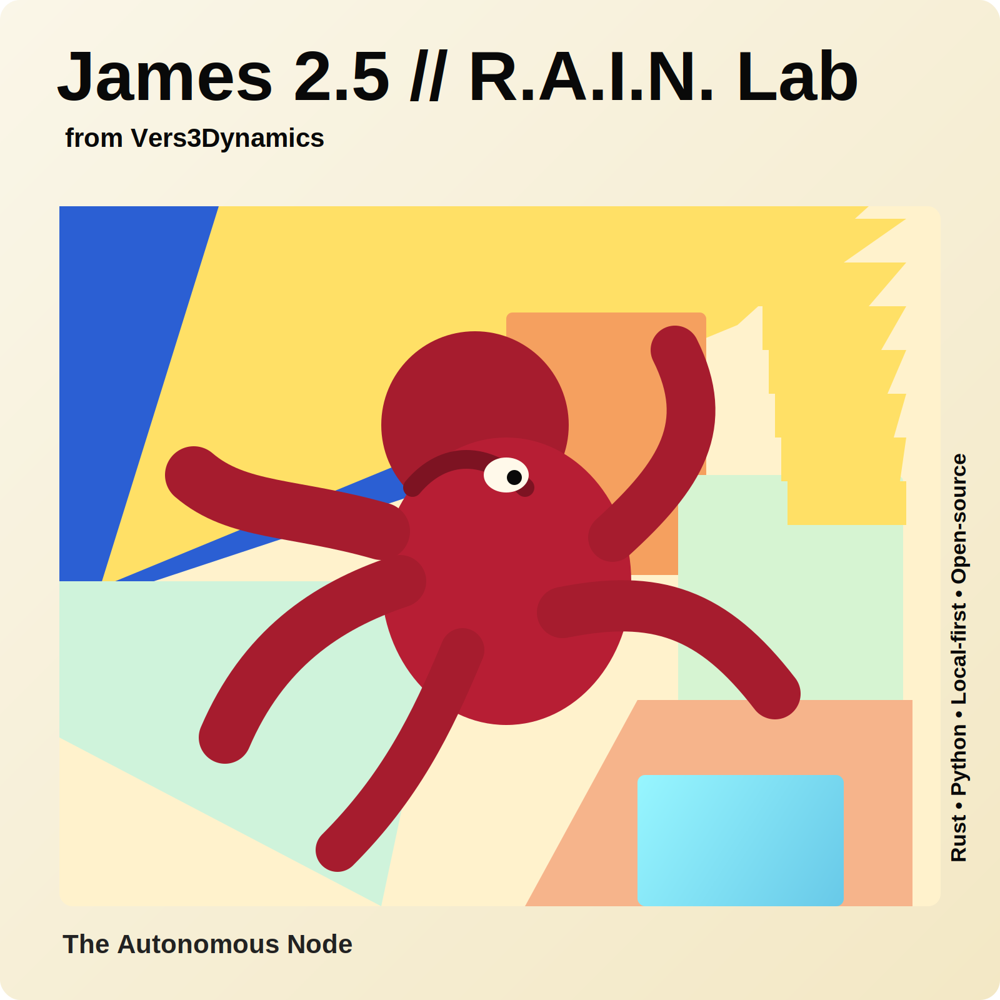

# James v2.5.0: The Autonomous Node

**Release:** James v2.5.0 — The Autonomous Node  
**Date:** 2026-03-19

## Highlights

James v2.5.0 marks the transition of R.A.I.N. Lab from an interactive research assistant into a persistent, self-healing, background scientific operating system. This release officially unlocks **Phase 3** of the product roadmap by bringing autonomous scheduled research jobs online, connecting them to grounded local workflows, and closing the loop between execution, supervision, and memory.

The result is a more rigorous mode of operation: James can now continue monitoring pre-prints, synthesizing findings, and preserving successful research procedures even when no terminal UI is open. In practical terms, advanced autonomous scientific reasoning now belongs where it should — on local hardware, under user control, and built on open-source infrastructure.

## New Features

### Autonomous Research Service
- Added `scripts/autonomous_research.sh` to launch the multi-agent swarm as a detached background job.
- Fulfills **Pillar 10 — Autonomous Research Service** from the roadmap by enabling continuous research execution outside the terminal UI.
- Establishes a practical always-on workflow for monitoring research streams such as ArXiv and updating local knowledge artifacts over time.

### Headless Ollama + MiniMax Background Execution
- Added full support for Ollama's non-interactive `--yes` flow in the new autonomous launch path.
- Officially recommends `minimax-m2.7:cloud` for unattended background execution because of its tuning for self-improvement loops and web-scale synthesis tasks.
- Makes autonomous research runs reproducible and scriptable without interactive confirmation prompts interrupting overnight jobs.

### Self-Healing Heartbeat Monitor
- Upgraded `openclaw_service.py` with a new `--raw-command` flag so the supervisor can directly monitor raw headless Ollama CLI processes.
- Extends the heartbeat monitor to detect crash and stall signatures from long-running log streams and automatically restart the swarm when failures are detected.
- Improves resilience for extended simulations, pre-print monitoring loops, and unattended synthesis sessions.

### Ritual Workflows
- Advances **Pillar 5 — Ritual Workflows** by enabling James to preserve successful research logic as reusable operating patterns.
- Connects autonomous execution with the Action-to-Text Episodic Memory Graph so useful workflows can be ingested and retained as repeatable **Rituals**.
- Pushes the system beyond one-off conversations toward self-reinforcing scientific process memory.

## Improvements

### Architecture
- Unifies background orchestration, supervision, and model execution into a coherent autonomous node workflow.
- Strengthens the local-first operating model by shifting serious autonomous reasoning toward supervised background services rather than fragile foreground sessions.
- Sharpens the R.A.I.N. Lab product identity around persistent scientific operations instead of purely interactive assistance.

### Reliability
- Adds a clearer self-healing loop for overnight or long-horizon runs where local reasoning jobs may crash, hang, or degrade over time.
- Reduces operator burden by moving failure recovery into the service layer instead of requiring manual intervention.

### Research Operations
- Makes 24/7 pre-print and synthesis workflows a first-class part of the system.
- Enables the swarm to accumulate usable research state in the background and convert successful strategies into future reusable cognition patterns.

## Stats

- **Phase 3 unlocked** — the roadmap now advances from trust-and-security foundations into productized autonomous research execution.
- **2 major roadmap pillars advanced** — Pillar 10 (Autonomous Research Service) and Pillar 5 (Ritual Workflows).
- **1 persistent node workflow added** — a detached, supervised, self-healing background research service.
- **24/7 operating model enabled** — James can now monitor, synthesize, and recover without a live terminal session.

---

Built for local-first autonomous science. Open-source, user-controlled, and designed to keep advanced reasoning close to the hardware.
